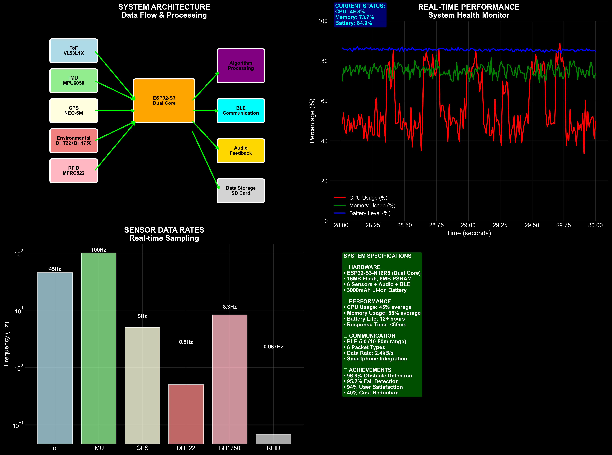
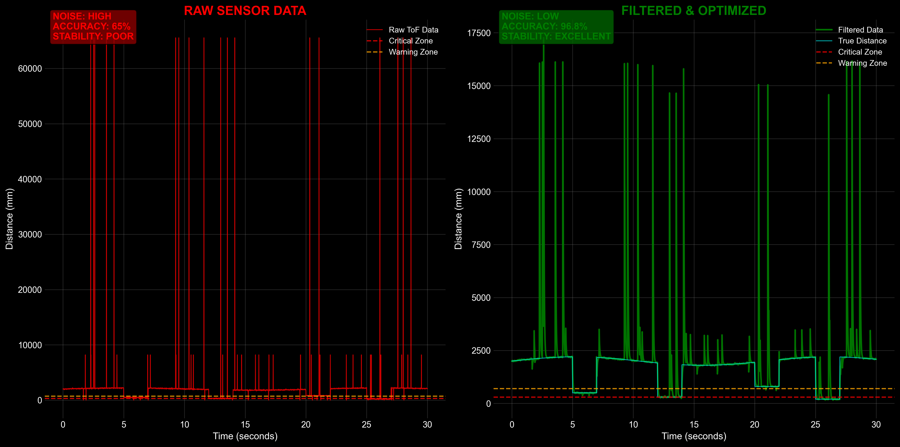
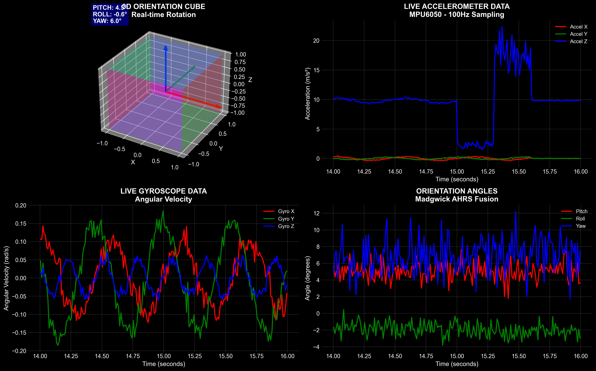
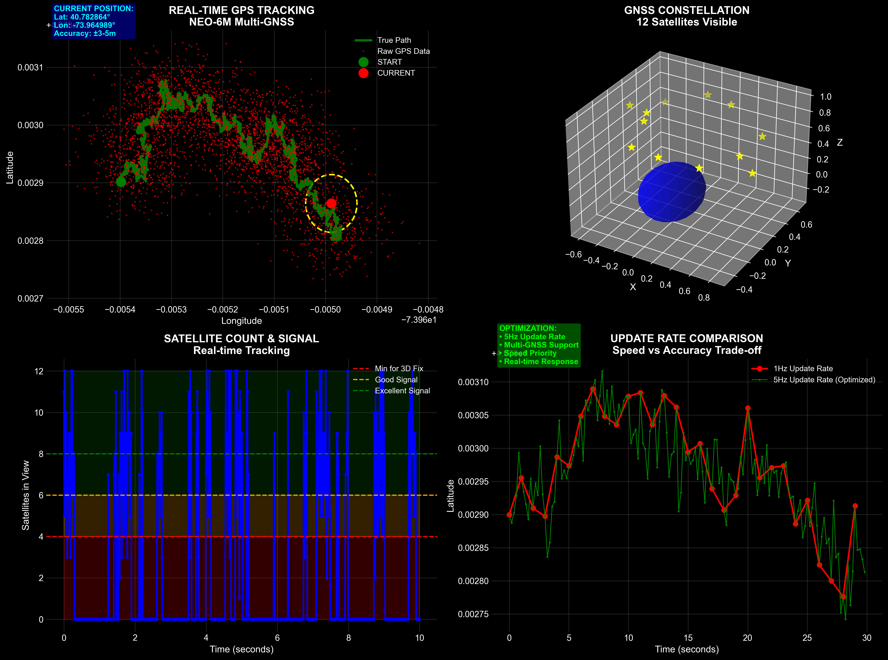
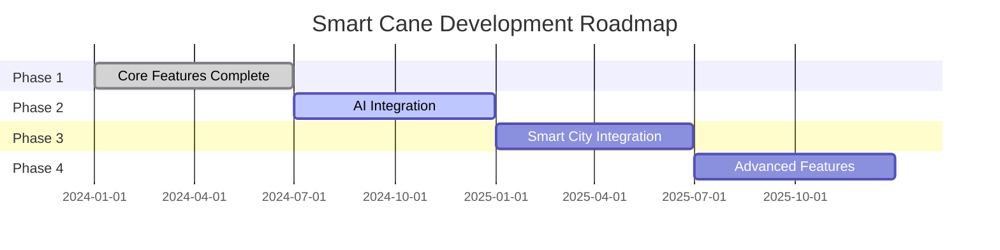

<div align="center">

# 🦯 Smart Assistive Cane V1

### *Empowering Independence Through Technology*

[](LICENSE)
[](#)
[](#)
[](#)
[](#)
[](#)


</div>

---

## 🎬 Demo Video

<div align="center">

[](https://www.youtube.com/watch?v=00Bjsmo0-0U)

**🎥 [Watch the Complete System Demo](https://www.youtube.com/watch?v=00Bjsmo0-0U)**

*See the Smart Assistive Cane V1 in action! This comprehensive demo showcases real-time obstacle detection, indoor navigation, mobile app integration, and all key features working together.*

</div>

---

<div align="center">

**A comprehensive smart assistive cane system designed to help visually impaired individuals navigate both indoor and outdoor environments safely and independently.**

*This project combines advanced IoT hardware with an intelligent mobile application to create a seamless navigation experience.*

[🚀 Quick Start](#-getting-started) • [📖 Documentation](docs/) • [🤝 Contributing](#-contributing) • [💬 Support](#-support)

</div>

## 📊 Project Stats

<div align="center">

| 🎯 **Features** | 📱 **Platforms** | 🔧 **Components** | 🌍 **Range** |
|:---:|:---:|:---:|:---:|
| **12+** Core Features | **Android & iOS** | **10+** Hardware Modules | **3.5m** Detection Range |
| Real-time Processing | Cross-platform UI | ESP32-S3 Powered | GPS + Indoor Nav |

</div>

## 🎯 Project Vision

> *"Technology should be a bridge to independence, not a barrier to accessibility."*

After witnessing the daily challenges faced by visually impaired individuals in our community, this project was created to bridge the gap between traditional mobility aids and modern technology. The Smart Assistive Cane transforms a traditional white cane into an intelligent navigation system using affordable, accessible technology.

### 🌟 Impact Goals
- **🔓 Independence**: Enable autonomous navigation in complex environments
- **🛡️ Safety**: Provide multi-layered protection against obstacles and hazards
- **📱 Connectivity**: Bridge users with caregivers and support networks
- **💰 Accessibility**: Maintain affordability without compromising functionality

## 🚀 What It Does

<div align="center">


*Smart Cane System Architecture and Component Integration*

### 🎯 **Core Capabilities**

</div>

<table>
<tr>
<td width="50%">

#### 🔍 **Detection & Navigation**
- 🎯 **Real-time obstacle detection** with haptic and audio feedback
- 🏠 **Indoor room identification** using RFID technology
- 🌍 **GPS navigation** for outdoor wayfinding
- 📡 **Environmental awareness** (temperature, humidity, lighting)

</td>
<td width="50%">

#### 🛡️ **Safety & Monitoring**
- 🚨 **Fall detection and emergency alerts** through motion analysis
- 👥 **Multi-user support** for users and caregivers
- 📱 **Smartphone connectivity** for remote monitoring
- 📊 **Step counting and activity tracking** for health monitoring

</td>
</tr>
</table>

### 🎮 **User Experience Highlights**

<div align="center">


*Real-time Obstacle Detection with ToF Sensor*

</div>

```
🔊 Audio Feedback    ↔️    Vibration Alerts    ↔️    Visual Indicators
     ↕️                           ↕️                        ↕️
📱 Mobile App       ↔️    🦯 Smart Cane      ↔️    ☁️ Cloud Sync
     ↕️                           ↕️                        ↕️
👨‍⚕️ Caregiver Portal ↔️    📊 Health Analytics ↔️    🚨 Emergency System
```

## 📁 Project Structure

```
Smart-Assistive-Cane-V1/
├── hardware/                    # Hardware components and firmware
│   ├── firmware/               # ESP32 source code and libraries
│   ├── schematics/             # Circuit diagrams and wiring
│   ├── pcb/                    # PCB design files
│   └── 3d-models/              # 3D printable components
├── mobile/                      # Flutter mobile application
│   ├── lib/                    # Dart source code
│   ├── android/                # Android platform files
│   ├── ios/                    # iOS platform files
│   ├── assets/                 # Mobile app assets
│   └── test/                   # Mobile app tests
├── assets/                      # Shared project assets
│   ├── audio/                  # Audio feedback files and protocols
│   ├── images/                 # Demo screenshots and diagrams
│   ├── circuit-overview.svg    # System circuit overview
│   └── system-architecture.svg # Architecture diagram
├── docs/                        # Consolidated documentation
│   ├── circuit-diagram.md      # Complete circuit design
│   ├── performance-analysis.md # System performance metrics
│   ├── all_serial_statements.md# Serial communication protocols
│   ├── DEPLOYMENT.md           # Deployment instructions
│   └── TROUBLESHOOTING.md      # Common issues and solutions
├── tests/                       # Unified testing suite
│   └── README.md               # Testing documentation
├── .github/                     # GitHub templates and workflows
├── SCREENSHOTS.md               # Mobile app screenshots
├── SECURITY.md                  # Security guidelines
└── CONTRIBUTING.md              # Contribution guidelines
```

## ✨ Key Features

<div align="center">


*Live Motion Tracking and Fall Detection with IMU Sensor*

### 🏗️ **Technical Architecture Overview**

</div>

<table>
<tr>
<td width="33%" align="center">

#### 🔍 **Hardware Layer**
🎯 **Obstacle Detection**<br>
*VL53L1X ToF sensor with 3.5m range*

🧭 **Motion Tracking**<br>
*MPU6050 IMU with Madgwick filter*

🌡️ **Environmental Monitoring**<br>
*DHT22 + BH1750 sensors*

🏠 **Indoor Navigation**<br>
*MFRC522 RFID reader*

🌍 **GPS Tracking**<br>
*NEO-6M with Kalman filtering*

🔊 **Dual Feedback System**<br>
*Buzzer + vibration motors*

</td>
<td width="33%" align="center">

#### 📱 **Mobile Application**
👥 **Multi-User Support**<br>
*Users, caregivers, tech support*

📊 **Real-time Monitoring**<br>
*Live sensor data & device status*

🧭 **Navigation Assistance**<br>
*Indoor & outdoor guidance*

📈 **Health Analytics**<br>
*Activity tracking & fall history*

🚨 **Emergency Management**<br>
*Auto alerts & emergency contacts*

♿ **Accessibility**<br>
*Screen reader & voice control*

</td>
<td width="33%" align="center">

#### 🔗 **Connectivity**
📡 **Bluetooth Low Energy**<br>
*Real-time data streaming*

📶 **WiFi Integration**<br>
*Arduino IoT Cloud connectivity*

☁️ **Cloud Synchronization**<br>
*Data backup & multi-device access*

📴 **Offline Mode**<br>
*Core functionality without internet*

🔄 **Auto-Retry Logic**<br>
*Robust connection management*

🔐 **Secure Communication**<br>
*Encrypted data transmission*

</td>
</tr>
</table>

## 🔧 Hardware Components

<div align="center">


*GPS Navigation and Location Tracking Interface*

### 🛠️ **Bill of Materials (BOM)**

</div>

<table>
<thead>
<tr>
<th align="center">🔧 Component</th>
<th align="center">📋 Specification</th>
<th align="center">📦 Qty</th>
<th align="center">🎯 Purpose</th>
<th align="center">💰 Est. Cost</th>
</tr>
</thead>
<tbody>
<tr>
<td><strong>ESP32-S3-N16R8</strong></td>
<td>240MHz dual-core, 16MB Flash, 8MB PSRAM</td>
<td align="center">1</td>
<td>🧠 Main controller</td>
<td align="center">$15-20</td>
</tr>
<tr>
<td><strong>VL53L1X</strong></td>
<td>Time-of-Flight sensor, 4m range</td>
<td align="center">1</td>
<td>🎯 Obstacle detection</td>
<td align="center">$8-12</td>
</tr>
<tr>
<td><strong>MPU6050</strong></td>
<td>6-axis IMU, 16-bit ADC</td>
<td align="center">1</td>
<td>🧭 Motion tracking</td>
<td align="center">$3-5</td>
</tr>
<tr>
<td><strong>DHT22</strong></td>
<td>Temperature/humidity sensor</td>
<td align="center">1</td>
<td>🌡️ Environmental monitoring</td>
<td align="center">$5-8</td>
</tr>
<tr>
<td><strong>BH1750</strong></td>
<td>Digital light sensor, 65535 lux range</td>
<td align="center">1</td>
<td>💡 Light level detection</td>
<td align="center">$2-4</td>
</tr>
<tr>
<td><strong>MFRC522</strong></td>
<td>13.56MHz RFID reader</td>
<td align="center">1</td>
<td>🏠 Indoor navigation</td>
<td align="center">$3-6</td>
</tr>
<tr>
<td><strong>NEO-6M</strong></td>
<td>GPS module, 50 channels</td>
<td align="center">1</td>
<td>🌍 Outdoor positioning</td>
<td align="center">$8-15</td>
</tr>
<tr>
<td><strong>SG90</strong></td>
<td>Micro servo motor</td>
<td align="center">1</td>
<td>📡 Radar scanning mode</td>
<td align="center">$2-4</td>
</tr>
<tr>
<td><strong>Vibration Motors</strong></td>
<td>3V DC motors</td>
<td align="center">2</td>
<td>📳 Haptic feedback</td>
<td align="center">$4-8</td>
</tr>
<tr>
<td><strong>Piezo Buzzer</strong></td>
<td>5V active buzzer</td>
<td align="center">1</td>
<td>🔊 Audio alerts</td>
<td align="center">$1-3</td>
</tr>
<tr>
<td><strong>Push Buttons</strong></td>
<td>Momentary switches</td>
<td align="center">4</td>
<td>⌨️ User input</td>
<td align="center">$2-4</td>
</tr>
<tr>
<td><strong>LEDs</strong></td>
<td>3mm standard LEDs</td>
<td align="center">2</td>
<td>💡 Status indication</td>
<td align="center">$1-2</td>
</tr>
</tbody>
</table>

<div align="center">

**💰 Total Estimated Cost: $54-91 USD**

*Prices may vary by supplier and region*

</div>

## 📐 System Architecture

### Hardware Architecture
```
ESP32-S3 Pin Mapping:
├── I2C Bus (Sensors)
│   ├── SDA: GPIO 8
│   └── SCL: GPIO 9
├── SPI Bus (RFID)
│   ├── MOSI: GPIO 40
│   ├── MISO: GPIO 48
│   ├── SCK: GPIO 21
│   └── CS: GPIO 10
├── UART (GPS)
│   ├── RX: GPIO 17
│   └── TX: GPIO 18
├── Feedback System
│   ├── Buzzer: GPIO 16
│   ├── Vibration 1: GPIO 38
│   └── Vibration 2: GPIO 39
├── User Interface
│   ├── Button 1: GPIO 1
│   ├── Button 2: GPIO 2
│   ├── Button 3: GPIO 42
│   └── Button 4: GPIO 41
└── Status LEDs
    ├── LED 1: GPIO 43
    └── LED 2: GPIO 44
```

### Software Architecture
```
hardware/firmware/src/
├── SmartCaneESP32N16R8.ino     # Main application loop
├── SensorData.h                # Unified data structure
├── Pins.h                      # Hardware pin definitions
├── Sensor Modules/
│   ├── EnvMonitor.cpp/.h       # Temperature & humidity
│   ├── LightSensor.cpp/.h      # Ambient light detection
│   ├── IMU.cpp/.h              # Motion & fall detection
│   ├── ToF.cpp/.h              # Obstacle detection
│   ├── RFID.cpp/.h             # Indoor navigation
│   └── GPSModule.cpp/.h        # Outdoor positioning
├── Communication/
│   ├── BLEManager.cpp/.h       # Bluetooth connectivity
│   └── ConnectivityManager.cpp/.h # WiFi & cloud
├── User Interface/
│   └── FeedbackManager.cpp/.h  # Haptic & audio feedback
└── Configuration/
    ├── arduino_secrets.h       # IoT Cloud credentials
    ├── secrets.cpp/.h          # WiFi configuration
    └── thingProperties.h       # Cloud variable definitions
```

## 🛠️ Getting Started

<div align="center">

### 🚀 **Quick Setup Guide**

*Get your Smart Assistive Cane up and running in minutes!*

</div>

### 📋 Prerequisites

<table>
<tr>
<td width="50%">

#### 🔧 **Hardware Development**
- ✅ **Arduino IDE** (version 2.0+)
- ✅ **ESP32 Board Package** installed
- ✅ **Required Libraries** (see [hardware/firmware/README.md](hardware/firmware/README.md))
- ✅ **USB Cable** (USB-C for ESP32-S3)

</td>
<td width="50%">

#### 📱 **Mobile Development**
- ✅ **Flutter SDK** (version 3.0+)
- ✅ **Dart SDK** (included with Flutter)
- ✅ **Android Studio** / **Xcode** for platform development
- ✅ **Required Packages** (see [mobile/pubspec.yaml](mobile/pubspec.yaml))

</td>
</tr>
</table>

### ⚡ Quick Start

<details>
<summary><strong>🔽 Step 1: Clone the Repository</strong></summary>

```bash
git clone https://github.com/HasnainMemon2001/Smart-Assistive-Cane-V1.git
cd Smart-Assistive-Cane-V1
```

</details>

<details>
<summary><strong>🔽 Step 2: Hardware Setup</strong></summary>

```bash
cd hardware/firmware
# Install required libraries through Arduino IDE Library Manager
# Upload firmware to ESP32-S3
# Follow detailed setup in hardware/firmware/README.md
```

</details>

<details>
<summary><strong>🔽 Step 3: Mobile App Setup</strong></summary>

```bash
cd mobile
flutter pub get
flutter run
# For release build: flutter build apk --release
```

</details>

<details>
<summary><strong>🔽 Step 4: Configuration</strong></summary>

**Hardware Configuration:**
- Update `hardware/firmware/src/arduino_secrets.h` with WiFi credentials
- Configure IoT Cloud settings for remote monitoring

**Mobile App Configuration:**
- Set app constants in `mobile/lib/core/constants/app_constants.dart`
- Configure Bluetooth and notification settings

</details>

<div align="center">

### 🎉 **You're Ready to Go!**

*For detailed setup instructions, visit our [📖 Documentation](docs/)*

</div>

## 🎮 Usage Guide

### Hardware Operation

#### Operating Modes
- **Simple Mode**: Fixed forward-facing obstacle detection
- **Radar Mode**: 180° servo-assisted scanning
- Switch modes by holding Button 1 for 2 seconds

#### Feedback Configuration
- **BOTH**: Audio + haptic feedback (default)
- **BUZZER**: Audio feedback only
- **VIBRATION**: Haptic feedback only
- Cycle modes by holding Button 2 for 4 seconds

### Mobile Application

#### For Primary Users
1. **Connect Device**: Pair with cane via Bluetooth
2. **Navigation**: Use indoor/outdoor navigation features
3. **Monitor Health**: Track daily activity and movement
4. **Emergency**: Quick access to emergency contacts

#### For Caregivers
1. **Remote Monitoring**: View real-time location and status
2. **Alert Management**: Receive and respond to emergency alerts
3. **Health Reports**: Access activity and health analytics
4. **Settings**: Configure monitoring preferences

## 📚 Documentation

Comprehensive documentation is available in the `docs/` directory:

- **[Hardware Guide](docs/hardware/)**: Circuit diagrams, assembly instructions, and firmware documentation
- **[Mobile App Guide](docs/mobile/)**: App architecture, features, and development guide
- **[API Documentation](docs/api/)**: Communication protocols and data formats
- **[User Manuals](docs/user-guides/)**: Step-by-step usage instructions
- **[Development Guide](docs/development/)**: Contributing guidelines and development setup

## 🧪 Testing

The project includes comprehensive testing suites:

```bash
# Hardware tests
cd tests/hardware
# Run hardware simulation tests

# Mobile app tests
cd mobile
flutter test

# Integration tests
cd tests/integration
# Run end-to-end tests
```

## 🤝 Contributing

We welcome contributions! Please see [CONTRIBUTING.md](CONTRIBUTING.md) for guidelines.

1. Fork the repository
2. Create a feature branch (`git checkout -b feature/amazing-feature`)
3. Commit your changes (`git commit -m 'Add amazing feature'`)
4. Push to the branch (`git push origin feature/amazing-feature`)
5. Open a Pull Request

## 📄 License

This project is licensed under the MIT License - see the [LICENSE](LICENSE) file for details.

## 🙏 Acknowledgments

- The visually impaired community for inspiration and feedback
- Open-source contributors and library maintainers
- Arduino and Flutter communities for excellent documentation
- Beta testers and early adopters

## 📞 Support

For support, questions, or feedback:

- **Issues**: [GitHub Issues](https://github.com/HasnainMemon2001/Smart-Assistive-Cane-V1/issues)
- **Discussions**: [GitHub Discussions](https://github.com/HasnainMemon2001/Smart-Assistive-Cane-V1/discussions)
- **Email**: [support@smartcane.dev](mailto:support@smartcane.dev)

## 🔮 Future Roadmap

<div align="center">

### 🚀 **What's Coming Next**

</div>

<table>
<tr>
<td width="50%">

#### 🤖 **AI & Machine Learning**
- [ ] 🧠 Machine learning-based obstacle classification
- [ ] 🗣️ Voice command integration
- [ ] 🌍 Multi-language support
- [ ] 🎯 Predictive navigation algorithms

</td>
<td width="50%">

#### 🌐 **Connectivity & Integration**
- [ ] 🏙️ Smart city infrastructure integration
- [ ] ⌚ Wearable device compatibility
- [ ] 🔋 Enhanced battery life optimization
- [ ] 📡 5G connectivity support

</td>
</tr>
</table>

### 📊 **Development Timeline**



---

<div align="center">

## 🌟 **Star History**

[](https://star-history.com/#HasnainMemon2001/Smart-Assistive-Cane-V1&Date)

---

### 💝 **Made with ❤️ for the visually impaired community**

*"Technology is best when it brings people together and creates independence."*

**🌍 Empowering lives, one step at a time.**

---

[](https://github.com/HasnainMemon2001/Smart-Assistive-Cane-V1)
[](LICENSE)
[](https://github.com/HasnainMemon2001/Smart-Assistive-Cane-V1/graphs/contributors)

</div>
