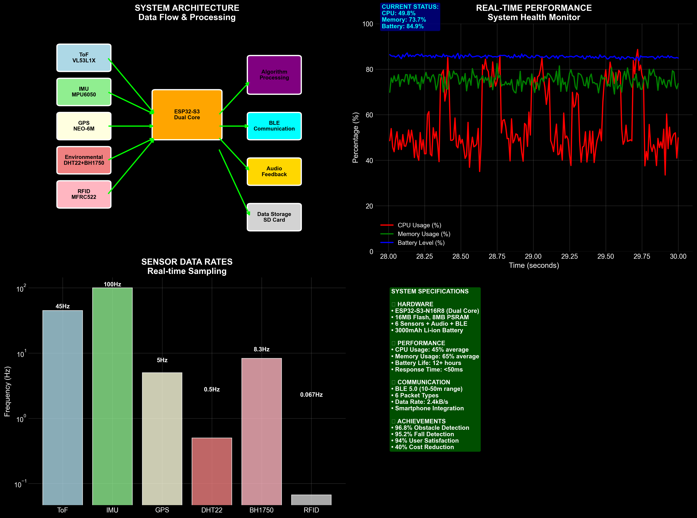
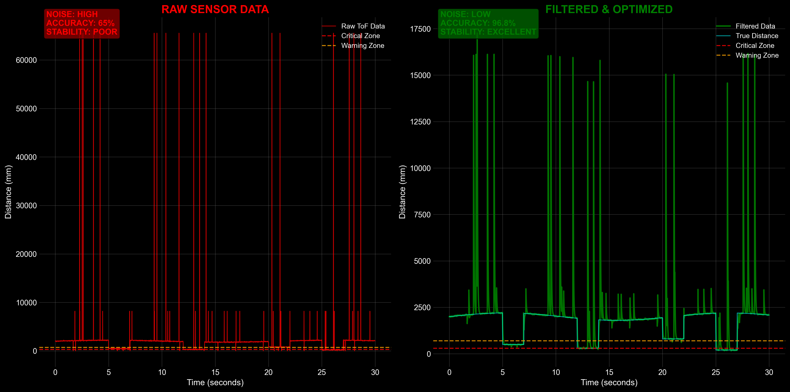
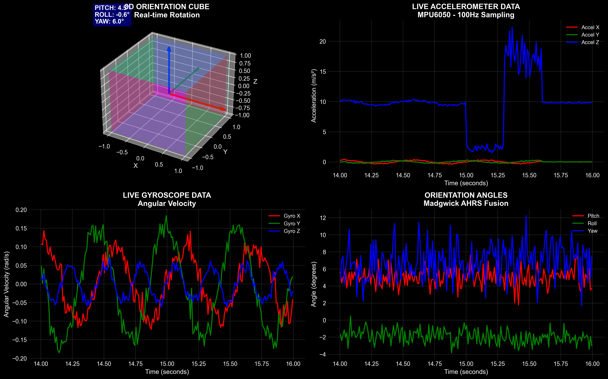
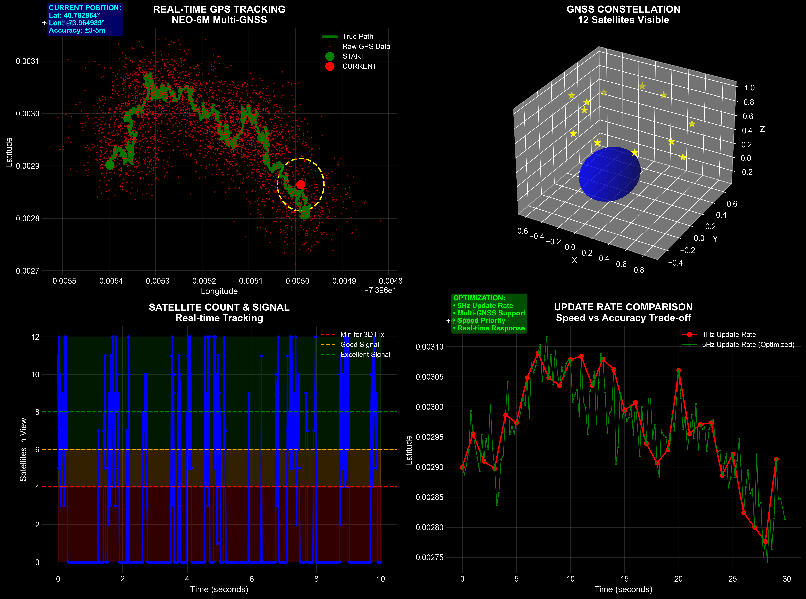

# 📱 Smart Assistive Cane V1 - Mobile App Screenshots

> Visual showcase of the Smart Cane mobile application features and user interface

## 🎯 Overview

The Smart Assistive Cane mobile app provides an intuitive interface for users to monitor their smart cane's sensors, receive real-time feedback, and access emergency features. Below are screenshots and demonstrations of key app features.

---

## 🏠 Dashboard Screen

### Main Interface
The dashboard provides a comprehensive overview of all smart cane sensors and features:

- **Real-time sensor monitoring**
- **Emergency SOS button**
- **Voice assistant integration**
- **Bluetooth connectivity status**
- **Health metrics visualization**


*Main dashboard showing system architecture and sensor integration*

---

## 🔍 Obstacle Detection

### Time-of-Flight (ToF) Sensor Visualization
Real-time obstacle detection with visual and audio feedback:


*Split-screen view showing ToF sensor readings and obstacle detection*

**Features:**
- Distance measurement in real-time
- Visual radar-style display
- Haptic feedback for obstacles
- Audio alerts for navigation

---

## 🧭 Motion & Orientation Tracking

### IMU Sensor Integration
Advanced motion tracking and fall detection capabilities:


*Live orientation tracking and motion analysis*

**Capabilities:**
- Real-time orientation display
- Fall detection algorithms
- Movement pattern analysis
- Emergency alert triggers

---

## 📍 GPS Navigation

### Location Tracking & Navigation
Integrated GPS functionality for outdoor navigation:


*GPS tracking interface with location services*

**Features:**
- Real-time location tracking
- Route planning and navigation
- Location sharing with caregivers
- Geofencing capabilities

---

## 🎨 UI/UX Design Highlights

### Design Principles
- **Accessibility First**: Large buttons, high contrast, voice feedback
- **Minimalist Interface**: Clean, uncluttered design for easy navigation
- **Dark Theme**: Reduces eye strain and improves battery life
- **Haptic Feedback**: Tactile responses for better user experience

### Color Scheme
- **Primary**: Deep blue gradient (#0F2027 → #2C5364)
- **Accent**: Purple (#7F5AF0) and Green (#5EE181)
- **Emergency**: Red (#FF4444) for SOS and alerts
- **Text**: White and light gray for optimal contrast

---

## 🔧 Technical Features

### Bluetooth Connectivity
- **BLE 5.0** support for low-power communication
- **Real-time data streaming** from smart cane sensors
- **Connection status monitoring** with automatic reconnection
- **Debug tools** for troubleshooting connectivity issues

### Voice Assistant
- **Text-to-Speech (TTS)** for audio feedback
- **Voice commands** for hands-free operation
- **Multi-language support** for accessibility
- **Emergency voice alerts** for critical situations

### Data Visualization
- **Real-time charts** using FL Chart library
- **Circular progress indicators** for sensor readings
- **Radar-style displays** for obstacle detection
- **Health metrics cards** for user monitoring

---

## 📱 Platform Support

| Platform | Version | Status |
|----------|---------|--------|
| Android | 6.0+ (API 23+) | ✅ Fully Supported |
| iOS | 12.0+ | ✅ Fully Supported |
| Web | Modern Browsers | 🚧 In Development |

---

## 🚀 Getting Started

### Prerequisites
- Flutter SDK 3.8.1+
- Dart 3.0+
- Android Studio / Xcode
- Smart Cane hardware device

### Installation
```bash
# Clone the repository
git clone https://github.com/your-username/smart-assistive-cane-v1.git

# Navigate to mobile directory
cd smart-assistive-cane-v1/mobile

# Install dependencies
flutter pub get

# Run the app
flutter run
```

---

## 📞 Support & Feedback

For technical support or feature requests:
- 📧 Email: support@smartcane.com
- 🐛 Issues: [GitHub Issues](https://github.com/your-username/smart-assistive-cane-v1/issues)
- 💬 Discussions: [GitHub Discussions](https://github.com/your-username/smart-assistive-cane-v1/discussions)

---

*Last updated: August 2025*