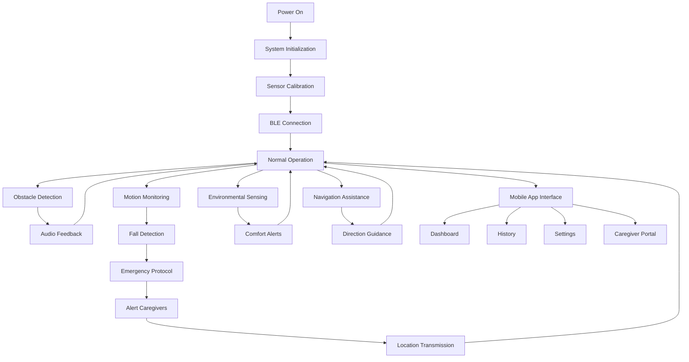

# Smart Assistive Cane V1 - Product Requirements Document

> Comprehensive product requirements for the Smart Assistive Cane V1, an advanced assistive technology system designed to enhance mobility and independence for visually impaired individuals.

## Table of Contents

- [Product Overview](#product-overview)
- [Core Features](#core-features)
- [Page Details](#page-details)
- [Core Process](#core-process)
- [User Interface Design](#user-interface-design)

## 1. Product Overview

The Smart Assistive Cane V1 is an intelligent mobility aid that combines traditional white cane functionality with modern sensor technology and smartphone connectivity. The system provides real-time obstacle detection, environmental awareness, indoor navigation, fall detection, and emergency assistance through an integrated ESP32-S3 controller and companion mobile application.

The product addresses critical mobility challenges faced by visually impaired individuals by offering enhanced spatial awareness, safety monitoring, and connectivity features that enable independent navigation while providing peace of mind to caregivers and family members.

Target market value: Assistive technology market for the 285 million visually impaired individuals worldwide, with focus on tech-savvy users seeking advanced mobility solutions.

## 2. Core Features

### 2.1 User Roles

| Role | Registration Method | Core Permissions |
|------|---------------------|------------------|
| Primary User | Direct device pairing via BLE | Full device control, sensor access, settings management |
| Caregiver | Invitation from primary user | Remote monitoring, alert notifications, location tracking |
| Emergency Contact | Added by primary user | Emergency notifications, location access during alerts |
| Technical Support | Service provider access | Diagnostic data, remote troubleshooting, update management |

### 2.2 Feature Module

Our Smart Assistive Cane system consists of the following main components:

1. **Hardware Platform**: ESP32-S3 based sensor array with multi-modal feedback systems
2. **Mobile Application**: Real-time monitoring dashboard with analytics and caregiver features
3. **Sensor Suite**: Obstacle detection, motion analysis, environmental monitoring, and navigation aids
4. **Feedback Systems**: Audio guidance, haptic feedback, and visual indicators
5. **Communication Hub**: BLE connectivity with serial command interface for configuration
6. **Data Management**: Local storage with cloud sync capabilities for analytics and history

### 2.3 Page Details

| Page Name | Module Name | Feature Description |
|-----------|-------------|---------------------|
| **Hardware Platform** | Sensor Array | Integrate VL53L1X ToF sensor for obstacle detection (0.04-4m range), MPU6050 IMU for fall detection and motion analysis, DHT22 for environmental monitoring, BH1750 for ambient light sensing, MFRC522 RFID for indoor room identification, NEO-6M GPS for outdoor positioning and navigation |
| **Hardware Platform** | Feedback Systems | Provide MAX98357A audio amplifier for voice guidance and alerts, dual vibration motors for directional haptic feedback, piezo buzzer for emergency alerts, RGB status LEDs for visual indicators, servo motor for physical cane tip adjustment |
| **Hardware Platform** | Processing Unit | Execute real-time sensor fusion on ESP32-S3-N16R8 (dual-core 240MHz), manage 16MB flash storage for audio files and configuration, utilize 8MB PSRAM for data buffering, implement FreeRTOS task scheduling for responsive operation |
| **Mobile Application** | Dashboard Screen | Display real-time sensor readings with visual indicators, show device connection status and battery level, provide quick access to emergency features, present current location and navigation status, offer immediate feedback mode controls |
| **Mobile Application** | History Screen | Visualize time-series data with interactive charts, export sensor data in CSV/JSON formats, filter data by date ranges and sensor types, track daily activity patterns and step counts, analyze environmental exposure and location history |
| **Mobile Application** | Serial Monitor | Send direct commands to device via BLE, display real-time command responses and debug output, maintain command history with autocomplete, provide preset command buttons for common operations, enable firmware debugging and diagnostics |
| **Mobile Application** | Caregiver Dashboard | Show real-time location on interactive map, display alert history and emergency notifications, manage emergency contact information, configure notification preferences, access device health and battery status |
| **Mobile Application** | Analytics Screen | Generate comprehensive activity reports, analyze movement patterns and mobility trends, track sensor performance and health metrics, provide insights on environmental conditions, create exportable reports for healthcare providers |
| **Mobile Application** | Settings Screen | Configure device parameters and thresholds, manage BLE connection and pairing, set audio volume and feedback preferences, customize alert types and emergency contacts, update firmware and app preferences |
| **Sensor Processing** | Obstacle Detection | Implement dual-mode ToF sensing (simple distance and radar scanning), provide real-time distance measurements with 50Hz update rate, detect obstacles in 120° field of view, generate audio and haptic warnings based on proximity thresholds |
| **Sensor Processing** | Motion Analysis | Monitor 3-axis acceleration and gyroscope data at 100Hz, detect fall events using machine learning algorithms, track step counting and activity levels, analyze gait patterns and movement stability, provide slope and terrain warnings |
| **Sensor Processing** | Environmental Monitoring | Measure temperature and humidity for comfort assessment, monitor ambient light levels for time-of-day awareness, detect weather conditions and environmental hazards, log environmental data for health tracking |
| **Sensor Processing** | Navigation Systems | Process GPS coordinates for outdoor positioning, scan RFID tags for indoor room identification, maintain location history and frequently visited places, provide turn-by-turn navigation assistance, integrate with mapping services |
| **Communication** | BLE Protocol | Establish secure encrypted connection with mobile device, transmit sensor data packets at 10Hz rate, implement command/response protocol for device control, maintain connection reliability with automatic reconnection, support multiple device pairing |
| **Communication** | Serial Interface | Provide comprehensive command set (50+ commands) for configuration, enable real-time debugging and diagnostic access, support parameter adjustment and calibration, implement help system and command validation, maintain command history and logging |
| **Data Management** | Local Storage | Store sensor readings on SD card with timestamp indexing, maintain configuration files and user preferences, log system events and error conditions, implement data rotation and cleanup policies, provide data export capabilities |
| **Data Management** | Cloud Integration | Sync data to secure cloud storage for backup, enable multi-device access to user data, provide analytics and reporting services, implement privacy controls and data anonymization, support caregiver data sharing with permissions |
| **Safety Systems** | Emergency Features | Detect fall events and automatically send alerts, provide manual emergency button activation, send GPS location to emergency contacts, implement escalating alert system, maintain emergency contact database |
| **Safety Systems** | Health Monitoring | Track device sensor health and performance, monitor battery levels and charging status, detect hardware failures and connectivity issues, provide predictive maintenance alerts, log system diagnostics and error reports |

## 3. Core Process

### Primary User Flow

The primary user interacts with the Smart Assistive Cane through physical manipulation and audio feedback. Upon powering on, the device performs sensor initialization and establishes BLE connectivity with the paired mobile device. During normal operation, the user receives continuous audio guidance for obstacle detection, environmental conditions, and navigation assistance. The system automatically detects falls and emergency situations, triggering alert protocols. Users can access advanced features through voice commands or the mobile application interface.

### Caregiver Flow

Caregivers access the system through the mobile application's dedicated dashboard. After receiving invitation and pairing authorization from the primary user, caregivers can monitor real-time location, receive emergency notifications, and access historical activity data. The system provides configurable alert thresholds and notification preferences, enabling caregivers to maintain appropriate oversight while respecting user independence.

### Technical Support Flow

Technical support personnel access diagnostic features through the serial command interface and specialized mobile app functions. This includes sensor calibration, firmware updates, system diagnostics, and performance monitoring. Support workflows include remote troubleshooting capabilities and comprehensive logging systems for issue resolution.

### System Navigation Flow

## 4. User Interface Design

### 4.1 Design Style

**Color Palette:**
- Primary: #2196F3 (Material Blue) - Trust and reliability
- Secondary: #4CAF50 (Material Green) - Safety and success
- Accent: #FF9800 (Material Orange) - Attention and warnings
- Error: #F44336 (Material Red) - Alerts and emergencies
- Background: #FAFAFA (Light Gray) - Clean and accessible
- Text: #212121 (Dark Gray) - High contrast readability

**Typography:**
- Primary Font: Roboto (Android) / San Francisco (iOS)
- Heading Sizes: 24sp (H1), 20sp (H2), 16sp (H3)
- Body Text: 16sp (large for accessibility)
- Caption Text: 14sp
- Minimum touch target: 48dp for accessibility

**Button Style:**
- Material Design elevated buttons with 8dp corner radius
- High contrast colors for accessibility compliance
- Large touch targets (minimum 48dp height)
- Clear visual feedback for press states
- Icon + text combinations for clarity

**Layout Style:**
- Card-based design with 8dp elevation
- Consistent 16dp margins and padding
- Top navigation with bottom tab bar
- Grid layouts for sensor data display
- Responsive design for various screen sizes

**Icon Style:**
- Material Design icons with 24dp standard size
- Outlined style for consistency
- High contrast colors for visibility
- Meaningful icons with text labels
- Custom icons for assistive technology features

### 4.2 Page Design Overview

| Page Name | Module Name | UI Elements |
|-----------|-------------|-------------|
| **Dashboard** | Status Overview | Large sensor value cards with color-coded status indicators, battery level progress bar with percentage, connection status icon with signal strength, emergency button (red, prominent placement), quick settings toggle switches |
| **Dashboard** | Real-time Data | Live distance readings with visual proximity indicator, temperature/humidity display with comfort zones, step counter with daily goal progress, GPS coordinates with accuracy indicator, RFID room identification display |
| **Dashboard** | Quick Actions | Audio volume slider with mute toggle, feedback mode selector (audio/vibration/both), emergency contact quick dial, device location sharing toggle, night mode activation switch |
| **History** | Data Visualization | Interactive line charts for sensor trends, date range picker with preset options, data export button with format selection, filter chips for sensor types, zoom and pan controls for detailed analysis |
| **History** | Activity Summary | Daily step count with weekly comparison, distance traveled with route visualization, time spent in different locations, environmental exposure summary, activity pattern analysis |
| **Serial Monitor** | Command Interface | Command input field with autocomplete, send button with keyboard shortcut, command history scrollable list, preset command buttons grid, clear log button with confirmation |
| **Serial Monitor** | Response Display | Scrollable log with timestamp prefixes, syntax highlighting for different message types, search functionality with regex support, copy/share log options, auto-scroll toggle |
| **Caregiver** | Location Tracking | Interactive map with real-time position marker, location history trail with timestamps, geofence boundary visualization, address lookup and reverse geocoding, map style selector (satellite/terrain/street) |
| **Caregiver** | Alert Management | Alert history list with severity indicators, notification settings with custom thresholds, emergency contact management interface, alert acknowledgment system, escalation policy configuration |
| **Analytics** | Performance Metrics | Sensor health status dashboard with traffic light indicators, battery usage trends with charging recommendations, connectivity statistics with signal quality, system uptime and reliability metrics |
| **Analytics** | Health Insights | Activity level trends with health recommendations, environmental exposure analysis, mobility pattern insights, fall risk assessment, usage pattern optimization suggestions |
| **Settings** | Device Configuration | Sensor threshold sliders with real-time preview, audio settings with test playback, vibration intensity adjustment, emergency contact management, firmware update status and controls |
| **Settings** | App Preferences | Theme selection (light/dark/auto), language selection with accessibility options, notification preferences with granular controls, data privacy settings, account management options |

### 4.3 Responsiveness

The mobile application is designed with a mobile-first approach, optimized for smartphones and tablets. The interface adapts to various screen sizes using responsive breakpoints:

- **Phone Portrait (320-480dp)**: Single column layout with stacked cards
- **Phone Landscape (480-600dp)**: Two-column layout for better space utilization
- **Tablet Portrait (600-840dp)**: Multi-column dashboard with expanded content areas
- **Tablet Landscape (840dp+)**: Full desktop-like interface with sidebar navigation

**Touch Interaction Optimization:**
- Minimum 48dp touch targets for accessibility compliance
- Gesture support for common actions (swipe to refresh, pinch to zoom)
- Haptic feedback for button presses and important interactions
- Voice control integration for hands-free operation
- Large text options and high contrast mode for visual accessibility

**Accessibility Features:**
- Screen reader compatibility with semantic markup
- Voice-over support for all interactive elements
- High contrast color options for low vision users
- Adjustable text sizes up to 200% scaling
- Alternative text for all images and icons
- Keyboard navigation support for external keyboards
- Focus indicators for navigation clarity

**Performance Considerations:**
- Smooth 60fps animations and transitions
- Efficient data loading with progressive enhancement
- Offline functionality for core features
- Battery optimization for background operations
- Minimal data usage with compression and caching

---

*This Product Requirements Document serves as the definitive specification for the Smart Assistive Cane V1 system, covering all functional requirements, user interfaces, and design specifications necessary for development and implementation.*

*Last updated: January 2025*