# Smart Assistive Cane V1 - Technical Architecture

> Comprehensive technical documentation for the Smart Assistive Cane system architecture, covering hardware design, firmware implementation, mobile application, and communication protocols.

## Table of Contents

- [System Overview](#system-overview)
- [Architecture Design](#architecture-design)
- [Hardware Architecture](#hardware-architecture)
- [Firmware Architecture](#firmware-architecture)
- [Mobile Application Architecture](#mobile-application-architecture)
- [Communication Protocols](#communication-protocols)
- [Data Models](#data-models)
- [Security Architecture](#security-architecture)
- [Performance Specifications](#performance-specifications)
- [Deployment Architecture](#deployment-architecture)

## System Overview

The Smart Assistive Cane V1 is a distributed assistive technology system consisting of three main components:

1. **Hardware Platform**: ESP32-S3 based sensor array with feedback systems
2. **Firmware**: Real-time embedded software for sensor processing and communication
3. **Mobile Application**: Flutter-based companion app for monitoring and control

The system is designed with modularity, accessibility, and real-time performance as core principles.

## Architecture Design

### High-Level System Architecture

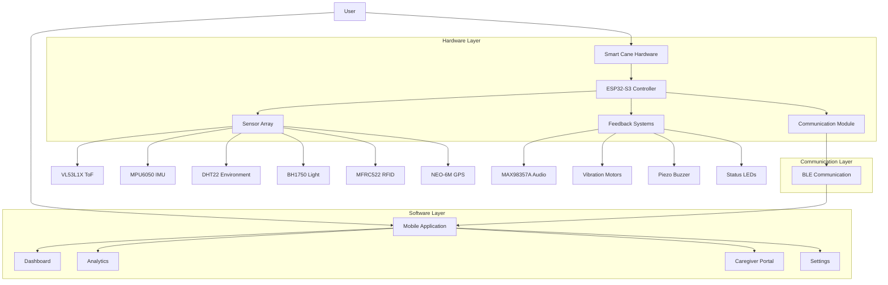

### Component Interaction Flow

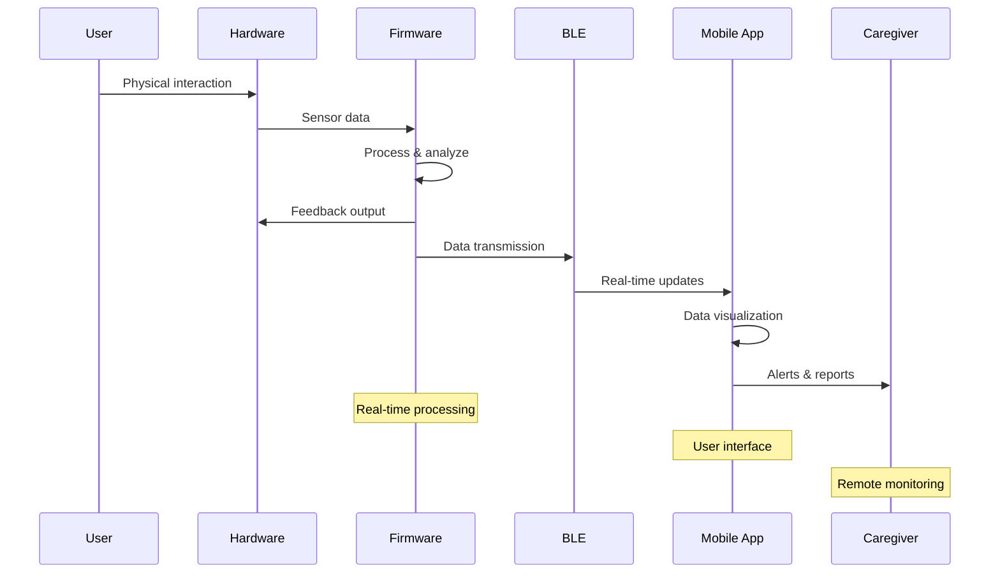

## Hardware Architecture

### Core Processing Unit

**ESP32-S3-N16R8 DevKit**
- **CPU**: Dual-core Xtensa LX7 @ 240MHz
- **Memory**: 512KB SRAM + 8MB PSRAM
- **Storage**: 16MB Flash
- **Connectivity**: WiFi 802.11 b/g/n, Bluetooth 5.0, BLE
- **GPIO**: 45 programmable pins
- **Peripherals**: I2C, SPI, UART, I2S, PWM, ADC

### Sensor Subsystem Architecture

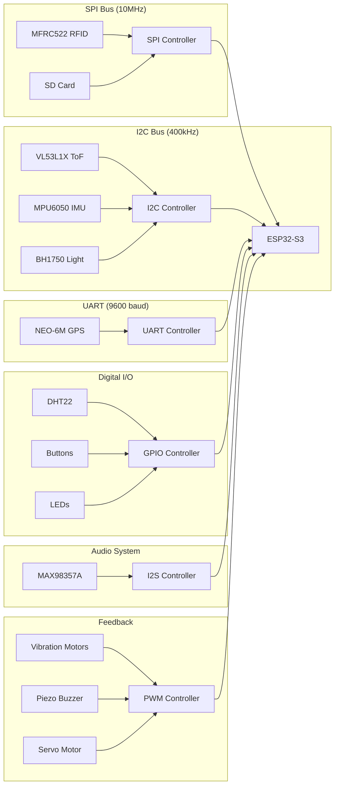

### Power Management Architecture

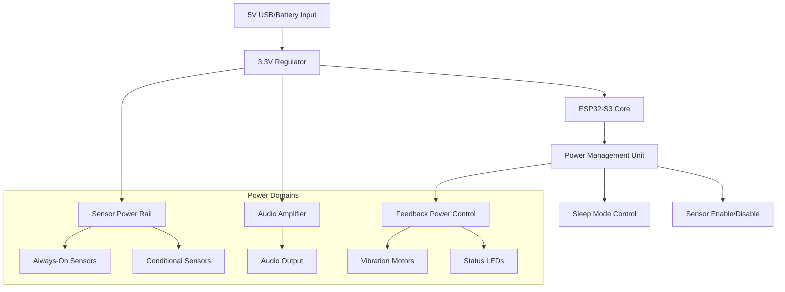

### Pin Assignment Architecture

| Function Category | Pins Used | Interface | Notes |
|------------------|-----------|-----------|-------|
| **I2C Bus** | GPIO8, GPIO9 | I2C | 4.7kΩ pull-ups |
| **SPI - RFID** | GPIO10-14 | SPI | High-speed communication |
| **SPI - SD Card** | GPIO34-37 | SPI | Separate CS line |
| **UART - GPS** | GPIO17, GPIO18 | UART | 9600 baud rate |
| **Audio System** | GPIO4-6 | I2S | 16-bit audio |
| **Feedback** | GPIO7, GPIO15-16, GPIO48 | PWM/Digital | Motor control |
| **User Interface** | GPIO1-3 | Digital | Buttons and DHT22 |
| **Status** | GPIO21 | Digital | IMU interrupt |

## Firmware Architecture

### Software Stack

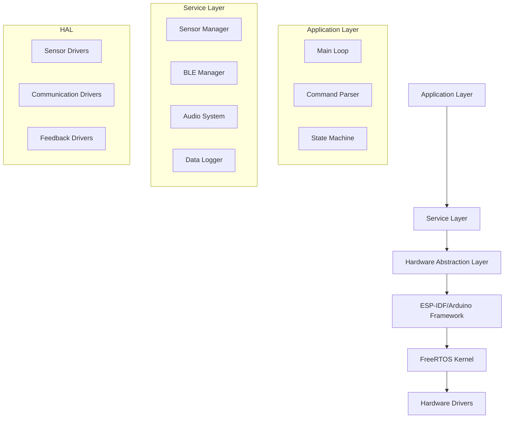

### Task Architecture (FreeRTOS)

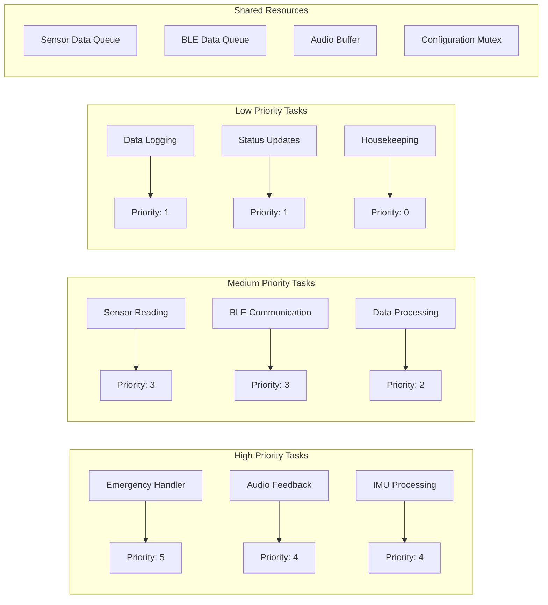

### Memory Management

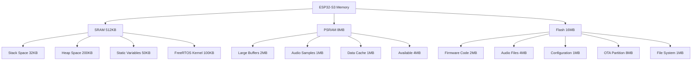

### Module Dependencies

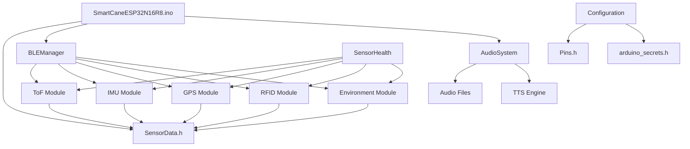

## Mobile Application Architecture

### Flutter Application Stack

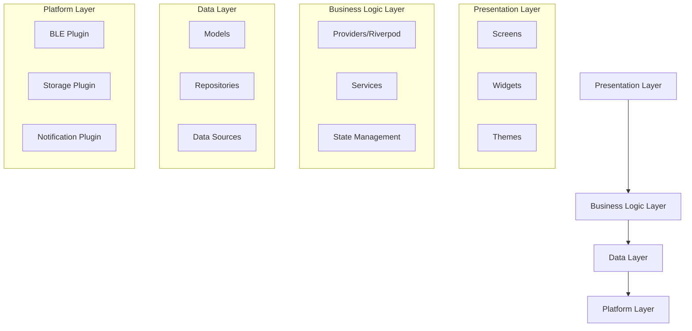

### State Management Architecture

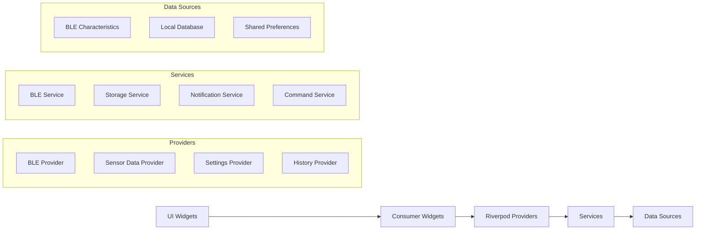

### Screen Navigation Architecture

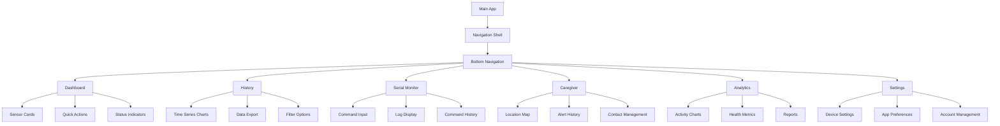

## Communication Protocols

### BLE Protocol Stack

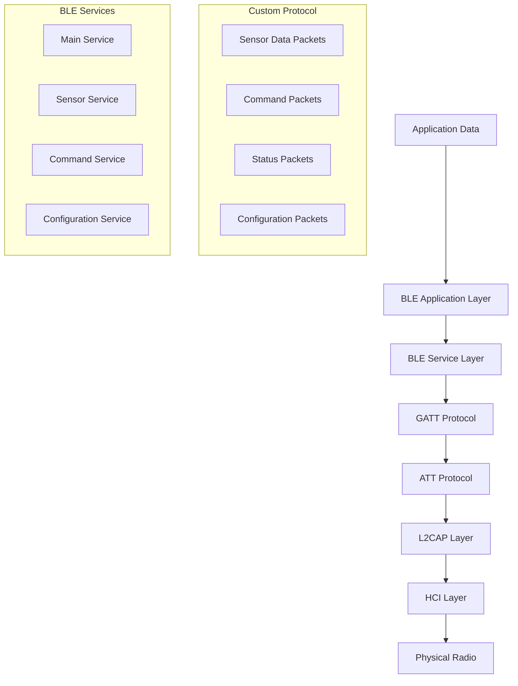

### BLE Service Definition

```cpp
// Service UUIDs
#define MAIN_SERVICE_UUID        "12345678-1234-1234-1234-123456789abc"
#define SENSOR_SERVICE_UUID      "87654321-4321-4321-4321-cba987654321"
#define COMMAND_SERVICE_UUID     "abcdef12-3456-7890-abcd-ef1234567890"

// Characteristic UUIDs
#define TEMPERATURE_CHAR_UUID    "temp-1234-5678-9abc-def012345678"
#define HUMIDITY_CHAR_UUID       "humi-1234-5678-9abc-def012345678"
#define DISTANCE_CHAR_UUID       "dist-1234-5678-9abc-def012345678"
#define IMU_CHAR_UUID           "imu-1234-5678-9abc-def012345678"
#define GPS_CHAR_UUID           "gps-1234-5678-9abc-def012345678"
#define RFID_CHAR_UUID          "rfid-1234-5678-9abc-def012345678"
#define BATTERY_CHAR_UUID       "batt-1234-5678-9abc-def012345678"
#define COMMAND_CHAR_UUID       "cmd-1234-5678-9abc-def012345678"
#define STATUS_CHAR_UUID        "stat-1234-5678-9abc-def012345678"
```

### Data Packet Structure

```cpp
// Sensor data packet (20 bytes max for BLE)
struct SensorPacket {
    uint8_t packet_type;      // 1 byte - packet identifier
    uint16_t sequence;        // 2 bytes - packet sequence number
    uint32_t timestamp;       // 4 bytes - milliseconds since boot
    float sensor_value;       // 4 bytes - primary sensor reading
    uint8_t status;          // 1 byte - sensor status flags
    uint8_t checksum;        // 1 byte - simple checksum
    uint8_t reserved[7];     // 7 bytes - padding/future use
};

// Command packet structure
struct CommandPacket {
    uint8_t command_id;      // 1 byte - command identifier
    uint8_t param_count;     // 1 byte - number of parameters
    uint8_t params[16];      // 16 bytes - command parameters
    uint8_t checksum;        // 1 byte - checksum
    uint8_t reserved[1];     // 1 byte - padding
};
```

### Serial Command Protocol

```
Command Format: <command> [param1] [param2] ... [paramN]\n

Command Categories:
1. System Commands
   - help, status, reset, version, uptime
   
2. Sensor Commands
   - tof_read, tof_mode <mode>
   - imu_read, imu_calibrate
   - gps_read, gps_status
   - env_read, light_read
   - rfid_scan, rfid_status
   
3. Feedback Commands
   - audio_test, audio_volume <level>
   - vibrate <duration>, buzzer <freq> <duration>
   - feedback_mode <mode>
   
4. Configuration Commands
   - set_threshold <value>, get_threshold
   - save_config, load_config
   - debug_on, debug_off
   
5. BLE Commands
   - ble_status, ble_restart
   - ble_send <data>
```

## Data Models

### Core Data Structures

```cpp
// Firmware data structures
struct SensorData {
    // Environmental data
    float temperature;        // Celsius
    float humidity;          // Percentage
    float light_level;       // Lux
    
    // Motion and positioning
    struct {
        float x, y, z;       // Acceleration (g)
        float gx, gy, gz;    // Gyroscope (deg/s)
        bool fall_detected;   // Fall detection flag
        float motion_energy;  // Motion intensity
    } imu_data;
    
    struct {
        double latitude;      // Degrees
        double longitude;     // Degrees
        float altitude;       // Meters
        float speed;         // km/h
        uint8_t satellites;   // Number of satellites
        bool fix_valid;      // GPS fix status
    } gps_data;
    
    // Proximity and navigation
    float distance;          // ToF distance (meters)
    uint8_t tof_mode;       // Simple=0, Radar=1
    char rfid_uid[16];      // RFID tag UID
    uint8_t room_id;        // Indoor room identifier
    
    // Activity tracking
    uint32_t step_count;     // Total steps
    uint32_t daily_steps;    // Steps today
    
    // System status
    float battery_level;     // Percentage
    uint8_t feedback_mode;   // Audio/Vibration/Both/None
    uint32_t uptime;        // Seconds since boot
    uint8_t sensor_health;   // Bitmask of sensor status
    
    // Timestamps
    uint32_t timestamp;      // Milliseconds since boot
    time_t rtc_time;        // Real-time clock
};
```

```dart
// Flutter data models
class SensorData {
  final double temperature;
  final double humidity;
  final double lightLevel;
  final IMUData imuData;
  final GPSData gpsData;
  final double distance;
  final ToFMode tofMode;
  final String? rfidUid;
  final int? roomId;
  final int stepCount;
  final int dailySteps;
  final double batteryLevel;
  final FeedbackMode feedbackMode;
  final Duration uptime;
  final SensorHealthStatus sensorHealth;
  final DateTime timestamp;
  
  const SensorData({
    required this.temperature,
    required this.humidity,
    required this.lightLevel,
    required this.imuData,
    required this.gpsData,
    required this.distance,
    required this.tofMode,
    this.rfidUid,
    this.roomId,
    required this.stepCount,
    required this.dailySteps,
    required this.batteryLevel,
    required this.feedbackMode,
    required this.uptime,
    required this.sensorHealth,
    required this.timestamp,
  });
  
  factory SensorData.fromJson(Map<String, dynamic> json) {
    // JSON deserialization
  }
  
  Map<String, dynamic> toJson() {
    // JSON serialization
  }
}
```

### Database Schema

```sql
-- SQLite schema for mobile app local storage

CREATE TABLE sensor_readings (
    id INTEGER PRIMARY KEY AUTOINCREMENT,
    timestamp INTEGER NOT NULL,
    temperature REAL,
    humidity REAL,
    light_level REAL,
    distance REAL,
    battery_level REAL,
    step_count INTEGER,
    latitude REAL,
    longitude REAL,
    altitude REAL,
    speed REAL,
    satellites INTEGER,
    rfid_uid TEXT,
    room_id INTEGER,
    sensor_health INTEGER,
    created_at INTEGER DEFAULT (strftime('%s', 'now'))
);

CREATE TABLE activity_sessions (
    id INTEGER PRIMARY KEY AUTOINCREMENT,
    start_time INTEGER NOT NULL,
    end_time INTEGER,
    total_steps INTEGER DEFAULT 0,
    distance_traveled REAL DEFAULT 0.0,
    average_speed REAL DEFAULT 0.0,
    locations_visited TEXT, -- JSON array of room IDs
    fall_incidents INTEGER DEFAULT 0,
    emergency_alerts INTEGER DEFAULT 0,
    created_at INTEGER DEFAULT (strftime('%s', 'now'))
);

CREATE TABLE device_events (
    id INTEGER PRIMARY KEY AUTOINCREMENT,
    event_type TEXT NOT NULL, -- 'fall', 'emergency', 'low_battery', etc.
    event_data TEXT, -- JSON data
    severity INTEGER DEFAULT 1, -- 1=info, 2=warning, 3=critical
    acknowledged BOOLEAN DEFAULT FALSE,
    timestamp INTEGER NOT NULL,
    created_at INTEGER DEFAULT (strftime('%s', 'now'))
);

CREATE TABLE user_settings (
    key TEXT PRIMARY KEY,
    value TEXT NOT NULL,
    updated_at INTEGER DEFAULT (strftime('%s', 'now'))
);

-- Indexes for performance
CREATE INDEX idx_sensor_readings_timestamp ON sensor_readings(timestamp);
CREATE INDEX idx_activity_sessions_start_time ON activity_sessions(start_time);
CREATE INDEX idx_device_events_timestamp ON device_events(timestamp);
CREATE INDEX idx_device_events_type ON device_events(event_type);
```

## Security Architecture

### Security Layers

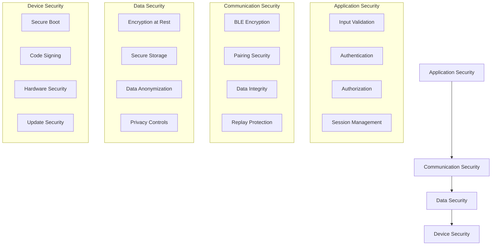

### BLE Security Implementation

```cpp
// BLE security configuration
void configureBLESecurity() {
    // Enable encryption
    BLEDevice::setEncryptionLevel(ESP_BLE_SEC_ENCRYPT);
    
    // Set security parameters
    esp_ble_auth_req_t auth_req = ESP_LE_AUTH_REQ_SC_MITM_BOND;
    esp_ble_io_cap_t iocap = ESP_IO_CAP_NONE;
    uint8_t key_size = 16;
    uint8_t init_key = ESP_BLE_ENC_KEY_MASK | ESP_BLE_ID_KEY_MASK;
    uint8_t rsp_key = ESP_BLE_ENC_KEY_MASK | ESP_BLE_ID_KEY_MASK;
    
    esp_ble_gap_set_security_param(ESP_BLE_SM_AUTHEN_REQ_MODE, &auth_req, sizeof(uint8_t));
    esp_ble_gap_set_security_param(ESP_BLE_SM_IOCAP_MODE, &iocap, sizeof(uint8_t));
    esp_ble_gap_set_security_param(ESP_BLE_SM_MAX_KEY_SIZE, &key_size, sizeof(uint8_t));
    esp_ble_gap_set_security_param(ESP_BLE_SM_SET_INIT_KEY, &init_key, sizeof(uint8_t));
    esp_ble_gap_set_security_param(ESP_BLE_SM_SET_RSP_KEY, &rsp_key, sizeof(uint8_t));
}
```

### Data Protection

```dart
// Flutter secure storage implementation
class SecureStorageService {
  static const _storage = FlutterSecureStorage(
    aOptions: AndroidOptions(
      encryptedSharedPreferences: true,
    ),
    iOptions: IOSOptions(
      accessibility: IOSAccessibility.first_unlock_this_device,
    ),
  );
  
  Future<void> storeSecureData(String key, String value) async {
    await _storage.write(key: key, value: value);
  }
  
  Future<String?> getSecureData(String key) async {
    return await _storage.read(key: key);
  }
  
  Future<void> deleteSecureData(String key) async {
    await _storage.delete(key: key);
  }
}
```

## Performance Specifications

### Real-Time Requirements

| Component | Update Rate | Latency | Accuracy |
|-----------|-------------|---------|----------|
| **ToF Sensor** | 50Hz | <20ms | ±3cm |
| **IMU** | 100Hz | <10ms | ±0.1g, ±1°/s |
| **GPS** | 1Hz | <1s | ±2.5m |
| **Environmental** | 0.1Hz | <100ms | ±0.5°C, ±2%RH |
| **BLE Communication** | 10Hz | <50ms | 99.9% reliability |
| **Audio Feedback** | Real-time | <100ms | 16-bit, 22kHz |
| **Fall Detection** | Real-time | <500ms | >95% accuracy |

### Power Consumption

| Mode | Current Draw | Battery Life* |
|------|-------------|---------------|
| **Idle** | 150mA | 48 hours |
| **Normal Operation** | 250mA | 28 hours |
| **Radar Mode** | 350mA | 20 hours |
| **Audio Active** | 500mA | 14 hours |
| **Sleep Mode** | 50mA | 140 hours |

*Based on 7000mAh battery capacity

### Memory Usage

| Component | SRAM Usage | PSRAM Usage | Flash Usage |
|-----------|------------|-------------|-------------|
| **FreeRTOS Kernel** | 100KB | 0KB | 200KB |
| **Application Code** | 80KB | 0KB | 1.5MB |
| **Sensor Drivers** | 50KB | 0KB | 300KB |
| **BLE Stack** | 60KB | 0KB | 400KB |
| **Audio System** | 40KB | 1MB | 4MB |
| **Data Buffers** | 30KB | 2MB | 0KB |
| **Available** | 152KB | 5MB | 9.6MB |

## Deployment Architecture

### Development Environment

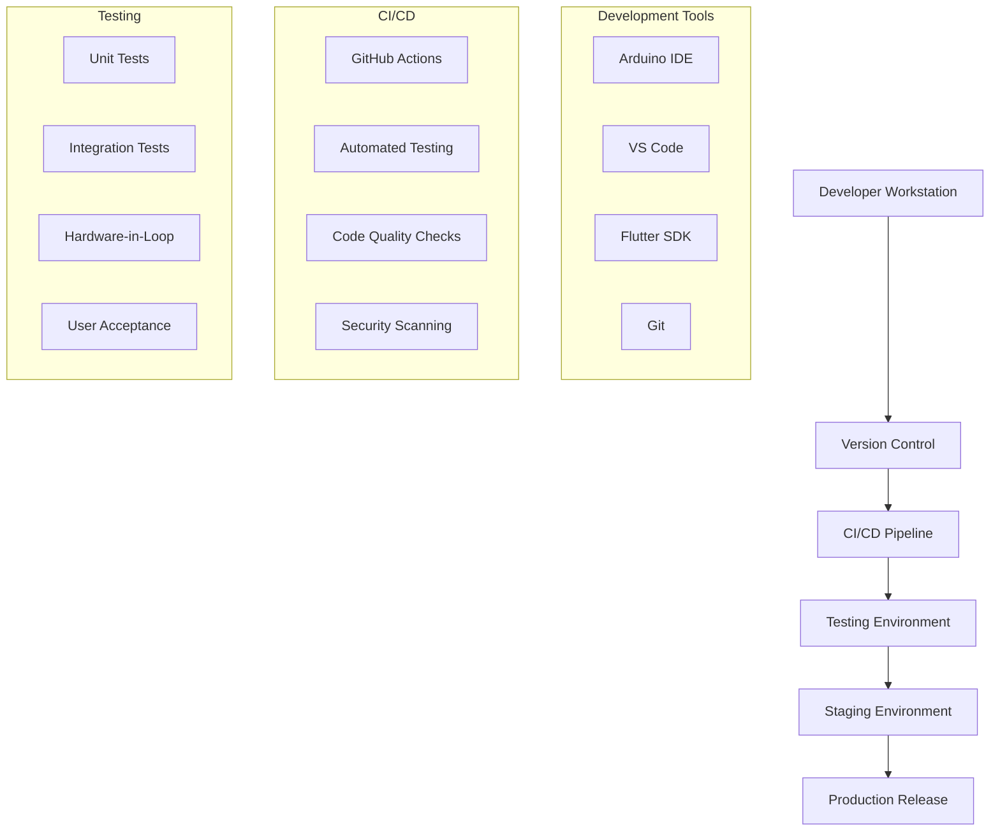

### Release Management

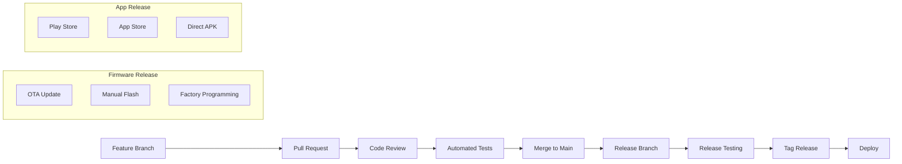

### Update Mechanisms

#### Firmware OTA Updates
```cpp
// OTA update implementation
#include <Update.h>
#include <WiFi.h>
#include <HTTPClient.h>

void checkForUpdates() {
    HTTPClient http;
    http.begin("https://api.smartcane.com/firmware/latest");
    
    int httpCode = http.GET();
    if (httpCode == HTTP_CODE_OK) {
        String payload = http.getString();
        // Parse version info
        if (newVersionAvailable(payload)) {
            downloadAndInstallUpdate();
        }
    }
    http.end();
}

void downloadAndInstallUpdate() {
    // Download firmware binary
    // Verify signature
    // Install update
    // Restart system
}
```

#### Mobile App Updates
```dart
// App update checking
class UpdateService {
  Future<bool> checkForUpdates() async {
    final packageInfo = await PackageInfo.fromPlatform();
    final currentVersion = packageInfo.version;
    
    // Check app store for updates
    final latestVersion = await getLatestVersion();
    
    return isNewerVersion(latestVersion, currentVersion);
  }
  
  Future<void> promptForUpdate() async {
    // Show update dialog
    // Direct to app store
  }
}
```

---

## Conclusion

The Smart Assistive Cane V1 technical architecture provides a robust, scalable, and maintainable foundation for assistive technology. The modular design allows for future enhancements while maintaining backward compatibility and ensuring reliable operation for users who depend on the system for their daily mobility and safety.

### Key Architectural Strengths

1. **Modularity**: Clear separation of concerns enables independent development and testing
2. **Real-time Performance**: FreeRTOS-based task scheduling ensures responsive operation
3. **Scalability**: Architecture supports additional sensors and features
4. **Security**: Multi-layer security approach protects user data and device integrity
5. **Accessibility**: Design prioritizes assistive technology requirements
6. **Maintainability**: Well-documented interfaces and standardized protocols

### Future Considerations

- **Edge AI**: Integration of machine learning models for enhanced obstacle classification
- **Cloud Connectivity**: Optional cloud services for data analytics and remote monitoring
- **Interoperability**: Standards-based interfaces for integration with other assistive technologies
- **Scalability**: Architecture ready for multi-device deployments and fleet management

---

*This technical architecture document serves as the authoritative reference for system design, implementation, and maintenance of the Smart Assistive Cane V1 platform.*

*Last updated: January 2025*